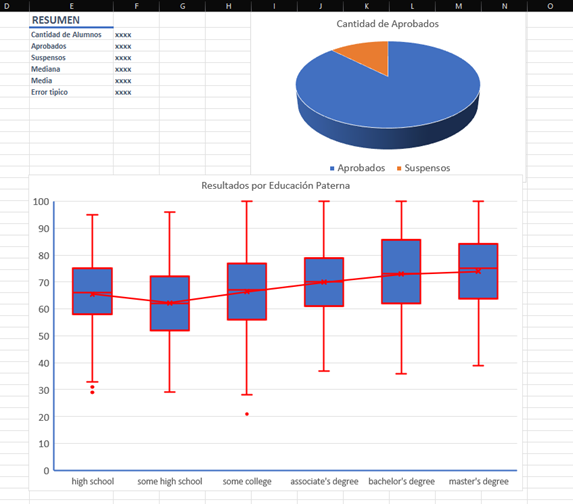

# Laboratory Exam Excel Computer Science Fundamentals 29th October 2022

A partir de los datos en formato .csv proporcionados, impórtelos en una hoja Excel guardada como sus dos apellidos y su
nombre (i.e Perico Fernández Suarez: `FernandezSuarezPerico.xlsx`). Se aconseja guardar este archivo en el escritorio e
ir realizando guardados periódicamente para evitar cualquier perdida de información. También se recomienda
encarecidamente que se compruebe que el fichero subido a la tarea es el correcto y no está vacío o incompleto, ya que es
lo que se evaluará.
En la hoja excel:

1. Importar los datos ([`exams.csv`](./data/exams.csv)) a la hoja Excel y dé el formato adecuado a las columnas.
2. Nómbrese `PromedioNotas` a la columna a la derecha de las proporcionadas y mediante una función conveniente,
   rellénese las celdas de la nueva columna con el promedio de la puntuación en matemáticas (`math score`), lectura (
   `reading score`)
   y escritura (`writing score`)
3. Nómbrese `MediaGeométrica` a la columna a la derecha del Promedio y mediante una función conveniente, rellénese las
   celdas con las tres mismas puntuaciones que en (2)
4. Nómbrese como `MejorMedia` a la columna a la derecha de `MediaGeométrica` y mediante una función conveniente, muestre
   el mayor de los dos promedios anteriormente calculados. Los valores de esta columna no mostrarán decimales,
   aproximando siempre al incremento superior válido
5. De formato a la columna `MejorMedia` de forma que si el alumno tiene una media inferior a 50 se coloree la casilla de
   color rojo
6. Proporciónese el nombre Media al rango formado por todos los valores de la Columna MejorMedia, usar este para hacer
   un resumen textual que muestre:
    1. Cantidad de alumnos.
    2. Número de aprobados.
    3. Número de suspensos.
    4. Media y Mediana
    5. Error típico[^1]
7. Insertar un gráfico de Bigotes (boxplot) que represente el nivel educativo de los padres, junto con la columna
   `MejorMedia` anteriormente calculada, en este gráfico:
    1. Ponerle como título “Resultados por Educación Paterna”
    2. Ponerles nombre adecuado a los ejes, ajustar el rango de estos para que se adapte a los datos
    3. Mostrar línea media del gráfico
    4. Dar un ancho a las líneas del grafico de 2 puntos además de cambiarle el color a rojo.
    5. Ancho de línea de ambos ejes 2puntos, color azul
8. Insertar un gráfico circular (quesito) que muestre la cantidad de aprobados y suspensos, mostrar su leyenda y ponerle
   un título adecuado
9. Emplear un filtro para que solamente se muestren los alumnos del grupo étnico C (`gender: male; race/ethnicity C`).
   Realizar este ejercicio al final y dejar el filtro activado de cara a entregar el examen. 
10. Aspecto orientativo de los gráficos y resúmenes creados: 

[^1]: Recordar que el error típico se calcula como la desviación estándar dividida entre la raíz del número de datos