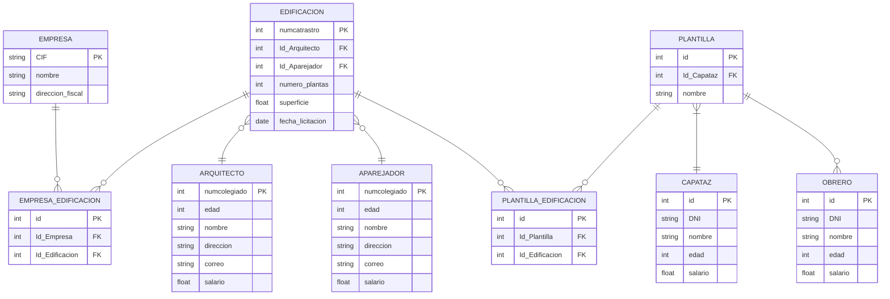

# DDBB Ordenadores

Dibujar el modelo entidad-relación de la base de datos ordenadores con las siguientes entidades:

- `Ordenadores (PCs)`: tienen un ID y un precio.
- `Procesador (CPU)`: tienen un ID y una descripción.
- `Disco`: tiene un ID, una descripción y una capacidad.
- `Tarjeta Gráfica`: tiene un ID, una capacidad y una descripción.
- `Memoria`: tiene un ID, una capacidad y una velocidad.
- `Fabricante`: tiene un ID, una dirección, un teléfono y un CIF.
- `Tipo de procesador`: tiene un ID, una descripción y un tipo de litografía.
- `Tipo de memoria`: tiene un ID y una descripción.

Además sabemos que:

Todos los componentes (procesadores, tarjetas gráficas, memoria y discos) tienen un fabricante que puede ser compartido
por todos ellos.

Los procesadores tienen un tipo de procesador asociado, este puede ser compartido por varios de ellos.

Tanto tarjetas gráficas como memorias van asociados a un tipo de memoria que puede ser común a todas ellas.

Los ordenadores tienen un componente de cada tipo (procesadores, tarjetas gráficas, memoria y discos), estos componentes
pueden ser compartidos por todos ellos.

  
SEE SOLUTION

# DDBB Hospitales

Dibujar el modelo entidad-relación de la base de datos hospitales compuesto de las siguientes entidades:

- `Hospital`: con un ID, un nombre, dirección y teléfono.
- `Sala`: con un ID, un nombre, y un número de camas.
- `Estancias`: con un ID, una fecha de entrada y salida.
- `Doctores`: con un ID y un nombre.
- `Plantilla`: con un ID, un nombre, una función, turno y salario.
- `Especialidades`: con su ID y su nombre.
- `Enfermedades`: con un ID y su nombre.
- `Pacientes`: con su ID, nombre, dirección, fecha de nacimiento, sexo y número de la seguridad social.

Además sabemos que:

Un paciente puede realizar una o varias estancias, asociadas a una misma o diferentes enfermedades.

Las estancias pueden realizarse en una misma o diferentes salas. Estas salas pertenecen a un hospital, el cual puede
tener varias de estas.

Una sala tiene asociada una plantilla, compuesta por uno o varios empleados.

El hospital tiene uno o varios doctores, pertenecientes a una especialidad.

  
SEE SOLUTION

# DDBB Pedidos

Dibujar el modelo entidad relación de la base de datos pedidos online con las siguientes entidades:

- `Productos`: con su ID, nombre, precio, estado y fecha de creación.
- `Etiquetas de producto`: Con su ID y nombre.
- `Pedidos`: con su ID, estado y fecha de creación.
- `País`: con su ID (código), nombre y nombre del continente al que pertenece.
- `Tienda`: con su ID, nombre, fecha de creación y su administrador.
- `Usuarios`: con su ID, nombre completo y fecha de registro.
- `Temporada`: con su ID, fecha de inicio y fecha de fin.

Además sabemos que:

Un producto puede estar en varios pedidos en cierta cantidad, a la vez que un pedido está compuesto por varios
productos. Los productos pueden tener una o varias etiquetas y una etiqueta estar en varios productos.

Un usuario pertenece a un país, a su vez este puede tener varios usuarios. De idéntica manera una tienda pertenece a un
país y un país tiene varias tiendas.

Las tiendas tienen varios productos, pero cada producto es vendido únicamente por una tienda.

Las tiendas organizan su facturación en temporadas, una tienda puede tener varias temporadas.

Existe un usuario único que es el administrador de la tienda, este a su vez puede administrar diferentes tiendas.

  
SEE SOLUTION

# DDBB MarketPlace

Dibujar el modelo entidad-relación de la base de datos:

- `Autores`: tiene un ID, nombre, país y URL
- `Libro`: tiene un ID o ISBN, un año de publicación, un título y un precio
- `Editorial`: tiene un ID, un nombre, dirección, teléfono y URL
- `Vendedor online`: tiene un ID, un email y una URL
- `Cesta de la compra`: tiene un ID y un número de referencia
- `Comprador`: tiene un ID, un nombre, dirección, email y número de tarjeta de crédito
- `Pedido`: tiene un ID, fecha y dirección

Además sabemos que:

Un libro puede estar escrito por uno o varios autores, pero pertenece a una sola editorial, la cual tiene varios libros.

Un vendedor tiene en stock varios libros, a su vez un mismo libro puede estar ofrecido por varios vendedores.

Una cesta de la compra pertenece a un solo comprador, este tiene una única cesta en la que puede tener varios libros, y
de estos varias unidades.

Un pedido pertenece a un solo cliente, los clientes pueden tener varios pedidos. Un pedido se compone de varios libros,
los cuales pueden estar en varios pedidos en una serie de unidades.

  
SEE SOLUTION

# DDBB Protectora de animales:

Dibujar el modelo entidad-relación de la base de datos protectora de animales con las siguientes entidades:

- `Centro`: tiene un identificador, una dirección, un teléfono, un email y un dueño.
- `Recinto`: tiene un id, una superficie y un tipo.
- `Animal`: tiene un id (microchip), un tipo, una fecha de entrada, una fecha de salida y un peso.
- `Vacuna`: tiene un id, un nombre y una fecha de caducidad.
- `Voluntario`: tiene un id, nombre, email, teléfono y una dirección.
- `Adopción`: tiene un id, una fecha y unas observaciones.
- `Colaboración`: tiene un id y una fecha.
- `Adoptante`: tiene un id, un nombre, una dirección y un teléfono.

Además sabemos que:

Un centro tiene varios recintos, los cuales pertenecen a un único centro. En estos recintos pueden albergar a varios
animales.

Un animal puede tener varias vacunas, a su vez varios animales pueden estar vacunados con la misma vacuna.

Los voluntarios pueden realizar colaboraciones, estás consisten en llevar a uno o varios animales a su casa durante un
fin de semana.

Los adoptantes realizan adopciones de un animal, un adoptante puede realizar varias adopciones.

  
SEE SOLUTION

# DDBB Empresas de Construcción:

Dibujar el modelo entidad-relación de la base de datos de unas empresas de construcción con las siguientes entidades:

- `Empresa`: tienen un id (CIF), un nombre y una dirección fiscal.
- `Edificación`: tienen un id (numcatrastro), un número de plantas, una superficie y una fecha de licitación.
- `Aparejador`: tiene un id (numcolegiado), una edad, un nombre, una dirección, un correo y un salario.
- `Obrero`: tiene un id, un DNI, un nombre, una edad y un salario
- `Arquitecto`: tiene un id (numcolegiado), una edad, un nombre, dirección, correo y un salario
- `Capataz`: tiene un id, un DNI, un nombre, una edad y un salario.
- `Plantilla`: tiene un Id y un nombre

Además sabemos que:

Una empresa puede trabajar en varias edificaciones, a su vez en una edificación pueden trabajar varias plantillas

Las edificaciones tienen asignado un arquitecto y un aparejador, los arquitectos y aparejadores pueden tener asignadas
varias edificaciones.

Los obreros pertenecen a una única plantilla, esta plantilla está formada por varios obreros y un capataz.El capataz
puede dirigir varias plantillas.

En una edificación pueden trabajar varias plantillas, a su vez una plantilla puede trabajar en varias edificaciones.

  
SEE SOLUTION

